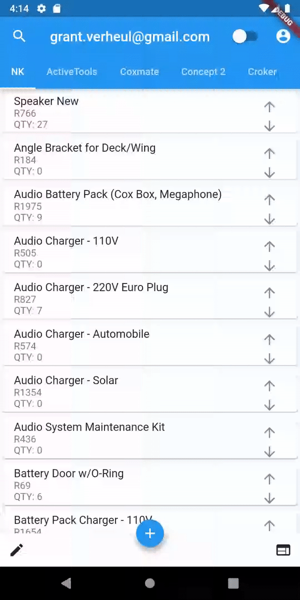
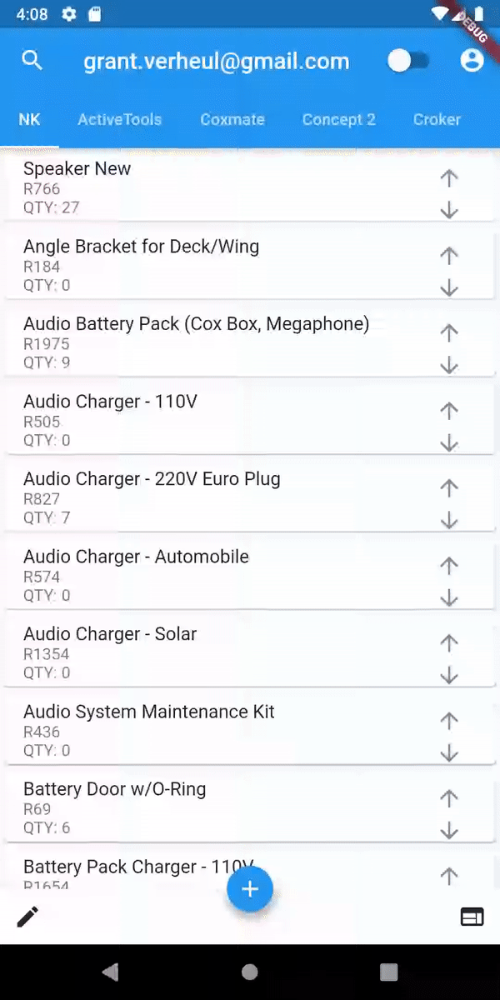
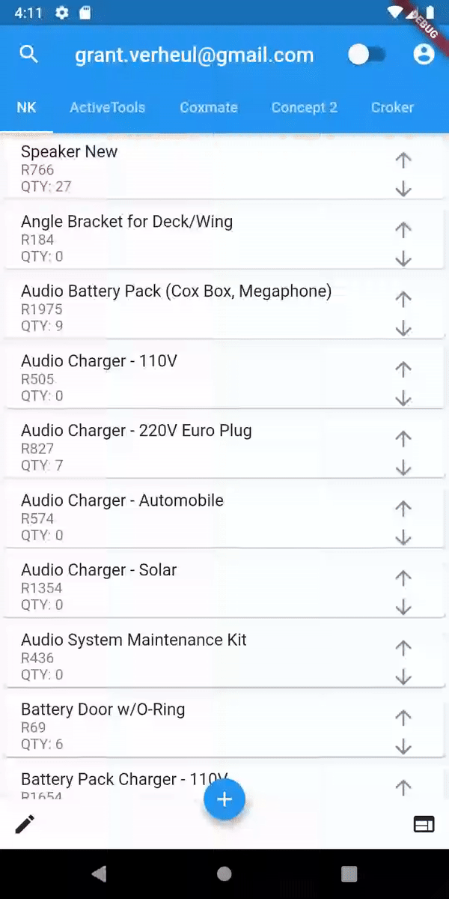
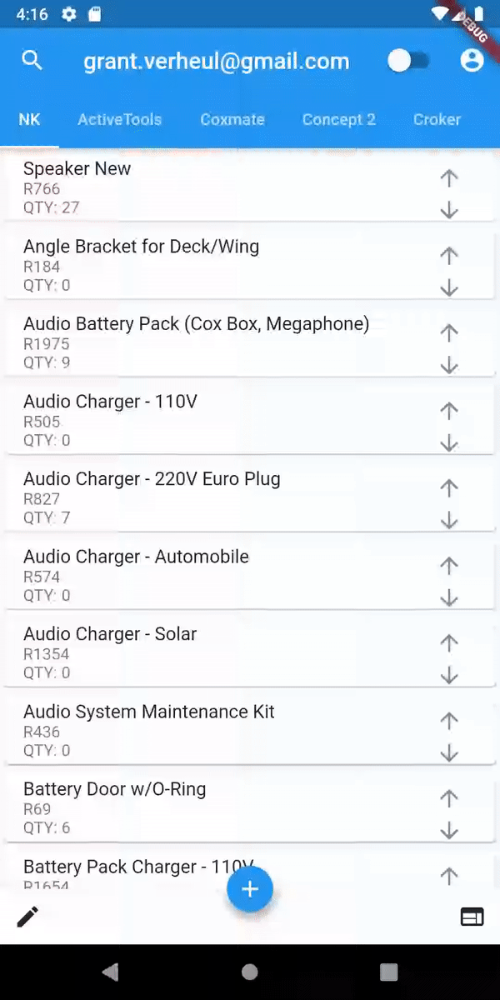

# macarbi_racing

This is a dart flutter app supporting Android, iOS and Windows*

The purpose of the app is to allow quick and easy access to prices and stock amount.

The app allows stock to be easily added and removed (set inactive for later refrence), 

Stock quantity to be adjusted by the arrows in the list or by tapping on a product allowing the user to edit all of the products fields.

Search functionality.

pull to refresh - manually update inforamtion from the database (if it has not done so automatically).

login and register - to note a user must be logged to be able to register another user, this was upon request. 

To-do noticeboard 

